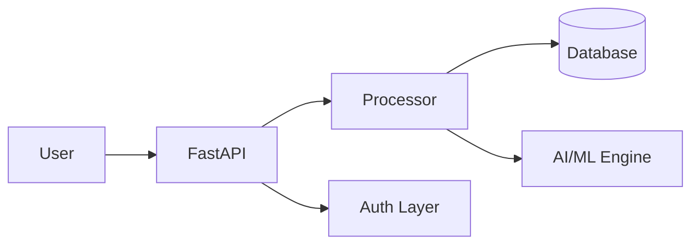

# Kirov Observability Platform

Centralized logging, metrics, and monitoring system for the **Kirov Security** ecosystem. Built on open-source standards: **Grafana**, **Loki**, **Prometheus**, and **OpenTelemetry**, with a lightweight Python log collector agent.


## Architecture



Microservices-based architecture with API Gateway, authentication layer, PostgreSQL persistence, and event-driven communication.

## Quick Start

```bash
# Clone and start the stack
git clone https://github.com/kirov-security/observability-platform.git
cd observability-platform
docker compose up -d

# Verify all services
docker compose ps

# Access Grafana
open http://localhost:3000  # admin / kirov-secure
```

## Service Matrix

| Service | Port | Purpose | Stack |
|---------|------|---------|-------|
| **Grafana** | 3000 | Dashboards & visualization | Grafana 11.2 |
| **Prometheus** | 9090 | Metrics storage & alerting | Prometheus 2.54 |
| **Loki** | 3100 | Log aggregation & storage | Loki 3.1 |
| **OTel Collector** | 4317 (gRPC), 4318 (HTTP) | Telemetry pipeline | OTEL Contrib 0.110 |
| **Log Collector** | 9095 | Log ingestion agent | Python / FastAPI |
| **Node Exporter** | 9100 | System metrics | Prometheus node_exporter |

## Integration Guide

### Python Services (FastAPI)

```python
from opentelemetry import trace
from opentelemetry.exporter.otlp.proto.grpc.exporter import OTLPSpanExporter
from opentelemetry.sdk.trace import TracerProvider

# Configure OTLP exporter
provider = TracerProvider()
provider.add_span_processor(
    BatchSpanProcessor(OTLPSpanExporter(endpoint="http://log-collector:9095"))
)
trace.set_tracer_provider(provider)
```

### Log Shipping (Any Language)

POST JSON log entries to the log collector:

```bash
curl -X POST http://log-collector:9095/api/v1/logs/ingest \
  -H "Content-Type: application/json" \
  -d '{
    "service": "api-gateway",
    "level": "error",
    "message": "Authentication failed: invalid token",
    "metadata": {"source": "auth", "user_id": "usr_abc123"}
  }'
```

### Metrics Push

Send custom metrics to Prometheus via the collector:

```bash
curl -X POST http://log-collector:9095/api/v1/metrics/push \
  -H "Content-Type: application/json" \
  -d '{
    "service": "api-gateway",
    "metrics": [{"name": "request_count", "value": 42}]
  }'
```

### Prometheus Scrape Target Config

Add to your `prometheus.yml`:

```yaml
scrape_configs:
  - job_name: 'my-service'
    static_configs:
      - targets: ['my-service:8080']
        labels:
          service: my-service
          tier: backend
```

## Dashboard Screenshots

| Dashboard | Description |
|-----------|-------------|
| **Kirov Security Overview** | Main operational view with service health, error rates, latency, alerts, log volume, and system resources |

Access dashboards at `http://localhost:3000/dashboards` after startup.

## Alerting Configuration

### Default Alert Rules

| Alert | Condition | Severity |
|-------|-----------|----------|
| **HighErrorRate** | >5% HTTP 5xx over 5m | critical |
| **ServiceDown** | `up == 0` for 1m | critical |
| **HighLatency** | p99 > 2s for 5m | warning |
| **DiskSpaceWarning** | <10% free disk | warning |
| **TooManyAlerts** | >50 alerts/min | critical |

### Customizing Alerts

Edit `prometheus/alerts.yml` and reload Prometheus:

```bash
# Reload Prometheus config without restart
curl -X POST http://localhost:9090/-/reload

# Or restart the container
docker compose restart prometheus
```

### Alert Notification Channels

Configure notification channels in Grafana:
1. Navigate to **Alerting > Contact Points**
2. Add Slack, PagerDuty, email, or webhook receivers
3. Link to notification policies in **Alerting > Notification Policies**

## Environment Configuration

Copy `.env.example` to `.env` and adjust:

```bash
cp .env.example .env
# Edit .env with your settings
docker compose --env-file .env up -d
```

## Development

### Running the Agent Locally

```bash
cd agent
pip install -r requirements.txt
export LOKI_URL=http://localhost:3100
export OTEL_ENDPOINT=localhost:4317
python agent.py
```

### Testing Forwarder

```python
from forwarder import LogForwarder
import asyncio

async def test():
    fwd = LogForwarder()
    await fwd.start()
    await fwd.forward_to_loki({"service": "test", "level": "info", "message": "hello"})
    await fwd.close()

asyncio.run(test())
```

<br/>
## Product Ladder

```
GitHub (this repo)
    ↓
Portfolio → https://raphasha27.github.io/raphasha-dev-portfolio
    ↓
Case Study → (coming soon)
    ↓
Live Demo → https://github.com/Raphasha27/kirov-observability-platform
    ↓
Contact → https://github.com/Raphasha27
```

Part of the [Kirov Dynamics](https://github.com/Raphasha27/kirov-dynamics) ecosystem.

**Built by Koketso Raphasha — Practical AI for Africa**